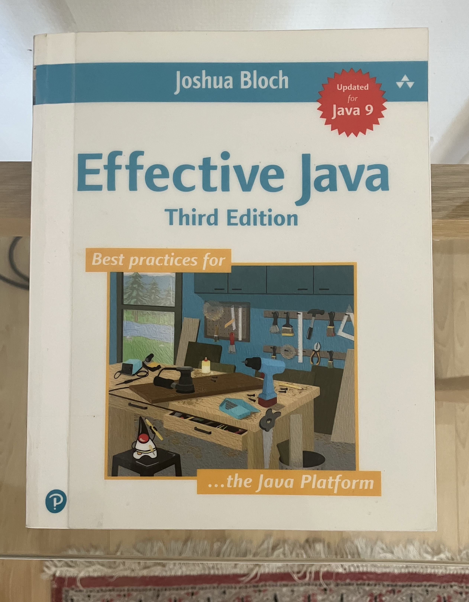

<!-- creation-date: 2026-06-13 -->
# Mon fil d'Ariane vers la maîtrise de Java

{.small-centered}

Mon équipe originelle s'étant recomposée, je suis amené à travailler sur un périmètre additionel dans ce nouvel idiome. Il m'incombe d'en saisir les nuances et la richesse afin de le manipuler avec finesse et précision. 

Ceci est mon fil d'Ariane pour m'y retrouver et documenter mon apprentissage. [^1]

{{summary}}

## Feuille de route chronologique

_Liste mise à jour en fonction de l'avancement._

### Syntaxe et Concepts

L'idée de cette étape est de suivre la documentation officielle tout en [réalisant les exercices](https://github.com/tjnvr/java-learning).

- [ ] Couche théorique du langage : étudier le site [The Java™ Tutorials](https://docs.oracle.com/javase/tutorial/index.html)
  - [x] [Object-Oriented Programming Concepts](https://docs.oracle.com/javase/tutorial/java/concepts/index.html)
  - [x] [Language Basics](https://docs.oracle.com/javase/tutorial/java/nutsandbolts/index.html)
  - [ ] [Classes and Objects](https://docs.oracle.com/javase/tutorial/java/javaOO/index.html)
  - [ ] [Annotations](https://docs.oracle.com/javase/tutorial/java/annotations/index.html)
  - [ ] [Interfaces and Inheritance](https://docs.oracle.com/javase/tutorial/java/IandI/index.html)
  - [ ] [Numbers and Strings](https://docs.oracle.com/javase/tutorial/java/data/index.html)
  - [ ] [L'intro sur les Generics ](https://docs.oracle.com/javase/tutorial/java/generics/index.html) et la [section plus avancée](https://docs.oracle.com/javase/tutorial/extra/generics/index.html)
  - [ ] [Packages](https://docs.oracle.com/javase/tutorial/java/package/index.html)
  - [ ] [Exceptions](https://docs.oracle.com/javase/tutorial/essential/exceptions/index.html)
  - [ ] [Basic I/O](https://docs.oracle.com/javase/tutorial/essential/io/index.html)
  - [ ] [Concurrency](https://docs.oracle.com/javase/tutorial/essential/concurrency/index.html)
  - [ ] [The Platform Environment](https://docs.oracle.com/javase/tutorial/essential/environment/index.html)
  - [ ] [Collections](https://docs.oracle.com/javase/tutorial/collections/index.html)
  - [ ] [Date Time](https://docs.oracle.com/javase/tutorial/datetime/index.html)
  - [ ] [Packaging Programs in JAR Files](https://docs.oracle.com/javase/tutorial/deployment/jar/index.html)
  - [ ] [Custom Networking](https://docs.oracle.com/javase/tutorial/networking/TOC.html)
  - [ ] [The Reflection API](https://docs.oracle.com/javase/tutorial/reflect/index.html)
- [ ] Faire le tutorial Maven [Apache Maven Tutorial](https://www.baeldung.com/maven)

### Approfondir la théorie

- [ ] Lire le livre [Effective Java](https://www.oreilly.com/library/view/effective-java-3rd/9780134686097/) pour écrire un code idiomatique et élégant.

- [ ] Lire le livre [Head First Design Patterns](https://www.oreilly.com/library/view/head-first-design/9781492077992/) pour approfondir les paradigmes de la programmation orientée objets.
- [ ] Lire le livre [Optimizing Cloud Native Java: Practical Techniques for Improving Jvm Application Performance](https://www.oreilly.com/library/view/optimizing-cloud-native/9781098149338/) pour creuser ce qui se passe sous le capot.

### Pratiquer

- [ ] Réaliser un projet personnel abouti (architecture logicielle, testabilité, déploiement, performances) [^2]

[^1]: Un point à noter cependant est le fait que je n'utiliserais pas de LLMs pour m'aider à l'écriture du code pendant ce voyage. L'idée est de me confronter à la difficulté afin d'intégrer un maximum de choses. C'est en quelque sorte la constitution ma capacité de réflexion relative à cet objet qui me permettra à l'avenir de mieux diriger et juger les verbiages des générateurs.
[^2]: En cours de réflexion, ce sera probablement une section qui va vivre et où je compte documenter mon avancement et mon apprentissage.
